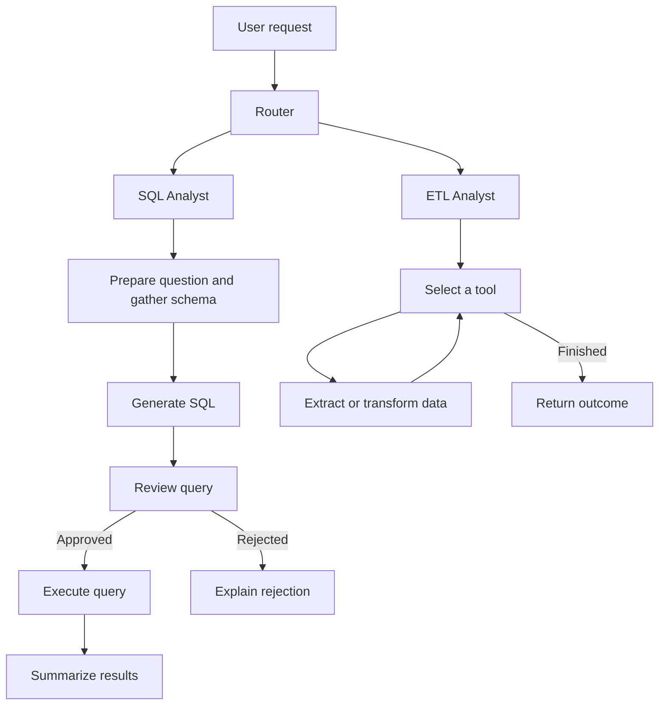

````markdown
# LangGraph Data Agent

A natural language assistant for querying PostgreSQL and running data workflows.

Built with LangGraph and Gemini. The assistant routes requests to a SQL agent or an ETL agent. It can answer database questions, extract API data and transform local files with pandas.

This is a local prototype using synthetic data. Generated SQL and Python need additional controls before use with sensitive data or untrusted requests.

## Features

| Workflow | Capabilities |
|---|---|
| SQL analysis | Read the database schema and generate SQL. Review queries before execution and explain the results. |
| Data extraction | Retrieve JSON from an API and save it as CSV, JSON or Parquet. |
| Data transformation | Generate and execute pandas code to transform local files. |
| Request routing | Select the SQL or ETL workflow based on the request. |

Example requests:

- “How many rides did we have in each city?”
- “Who are the top five drivers by average rating with at least 20 ratings?”
- “Extract this API response and save it as CSV.”
- “Filter this file and save the result.”

## Architecture



### SQL workflow

The SQL agent follows a fixed sequence:

```text
Question → Schema context → SQL generation → Review → Execution → Answer
                                                └→ Rejection
```

A second model reviews the generated query and returns a structured decision on whether it should run.

### ETL workflow

The ETL agent uses a tool calling loop:

```text
Request → Model → Tool execution → Model → Final response
```

The model selects extraction or transformation tools and processes their results until the task is complete.

Graph definitions are available in the repository’s `*_graph.mmd` files.

## Technology Stack

| Component | Technology |
|---|---|
| Workflow orchestration | LangGraph |
| Model integration | LangChain and Google Gemini |
| Structured outputs | Pydantic |
| Database | PostgreSQL |
| Database driver | psycopg2 |
| Data processing | pandas |
| Synthetic data | Faker |
| Configuration | python-dotenv |

## Quick Start

### Prerequisites

- Python 3.12+
- Docker or an existing PostgreSQL instance
- A Gemini API key from [Google AI Studio](https://aistudio.google.com/)

### 1. Clone the repository

```bash
git clone https://github.com/shrutipingle02/langgraph-data-agent.git
cd langgraph-data-agent
```

### 2. Create a virtual environment

```bash
python -m venv .venv
```

**macOS or Linux**

```bash
source .venv/bin/activate
```

**Windows PowerShell**

```powershell
.\.venv\Scripts\Activate.ps1
```

### 3. Install dependencies

```bash
pip install -r requirements.txt
```

### 4. Configure the environment

Copy `.env.example` to `.env`.

**macOS or Linux**

```bash
cp .env.example .env
```

**Windows PowerShell**

```powershell
Copy-Item .env.example .env
```

Set your API key and database connection:

```dotenv
GOOGLE_API_KEY=your_gemini_api_key

host=localhost
port=5432
user=postgres
password=postgres
database=postgres
```

Optional model overrides:

```dotenv
LLM_MODEL_LOW=your_supported_model_id
LLM_MODEL_MEDIUM=your_supported_model_id
LLM_MODEL_HIGH=your_supported_model_id
```

Use model IDs available to your account. See `utils/llm_pick.py` for the defaults.

Keep API keys and credentials out of version control.

### 5. Start PostgreSQL

This configuration is intended for the synthetic data demo.

```bash
docker run -d --name data-agent-pg \
  -e POSTGRES_PASSWORD=postgres \
  -e POSTGRES_USER=postgres \
  -e POSTGRES_DB=postgres \
  -p 127.0.0.1:5432:5432 \
  -v data_agent_pgdata:/var/lib/postgresql/data \
  postgres:16
```

### 6. Generate and load the data

```bash
python generate_data.py
python feed_db.py
```

### 7. Start the assistant

```bash
python main.py
```

Enter a database question or an ETL request. Press `Ctrl+C` to exit.

## Examples

### Query related tables

**Request**

```text
How many rides did we have in each city?
```

**Example generated SQL**

```sql
SELECT
    u.city,
    COUNT(r.ride_id) AS total_rides
FROM rides r
JOIN users u ON r.rider_id = u.user_id
GROUP BY u.city
ORDER BY total_rides DESC
LIMIT 10;
```

The SQL agent executes an approved query and explains the results.

This query groups rides by the rider’s recorded city. That may differ from the intended trip location and illustrates why ambiguous questions need careful interpretation.

### Aggregate with a minimum sample size

```text
Who are our top 5 drivers by average rating
with at least 20 ratings?
```

This request requires joining records and calculating average ratings. It also filters out drivers with fewer than 20 ratings.

### Extract API data

```text
Extract the data from https://pokeapi.co/api/v2/pokemon
and save it as CSV into the data/extract folder.
```

### Transform a local file

```text
Take data/extract/extracted_data.csv
and keep only rows where name contains 'saur'.
Save the result as CSV to the data/transform folder.
```

The transformation tool previews the input and generates pandas code before executing it.

These examples demonstrate individual workflows. They are not an accuracy benchmark. Generated outputs may vary between runs.

## Sample Dataset

The demo uses a seeded synthetic ride dataset with approximately **110,000 rows** across five related tables.

| Table | Rows | Description |
|---|---:|---|
| `users` | 8,000 | Rider and driver profiles |
| `vehicles` | 2,200 | Vehicles linked to drivers |
| `rides` | 40,000 | Trip details and fares |
| `payments` | 35,235 | Payment amounts and status |
| `ratings` | 24,726 | Ratings and optional comments |

The data includes canceled rides and missing ratings. Some comments are blank and payments have different statuses.

The relationships support questions involving joins and aggregations. All records are synthetic.

## Model Configuration

Different workflow steps use configurable model tiers.

| Tier | Use |
|---|---|
| Low | Question preparation and answer generation |
| Medium | SQL generation and query review |
| High | Routing and tool selection along with transformation code generation |

Configure the tiers in `utils/llm_pick.py` or override them through environment variables.

Tier names describe the configuration. They do not establish measured improvements in speed or accuracy.

## Safeguards and Limitations

### SQL review

A second model reviews generated SQL before execution. The repository includes examples of rejected destructive requests.

Model review is not a security guarantee. The demo uses the `postgres` account. A restricted database role should enforce read-only access during querying.

Parameterized schema lookups do not make arbitrary generated SQL safe.

### Python execution

The ETL tool runs generated Python through `exec()`.

This code operates with the permissions of the Python process. Use an isolated environment with synthetic or disposable data.

### External model requests

Schema details and sample data may be sent to the model provider. File previews and query results may also be included.

Review the implementation before connecting private datasets.

### Result correctness

A query can execute successfully while answering the wrong question. A transformation can create a valid file while applying the wrong business rule.

Inspect generated queries and outputs when correctness matters.

### Evaluation

The examples demonstrate specific tasks. They do not establish overall routing accuracy or workflow reliability.

## Repository Structure

```text
langgraph-data-agent/
├── agents/
│   ├── data_agent.py
│   ├── sql_analyst.py
│   └── etl_analyst.py
├── Models/
│   └── schema.py
├── utils/
│   ├── database.py
│   ├── etl_tools.py
│   └── llm_pick.py
├── data/
├── .env.example
├── main.py
├── generate_data.py
├── feed_db.py
├── pyproject.toml
├── requirements.txt
├── data_agent_graph.mmd
├── sql_analyst_graph.mmd
└── etl_analyst_graph.mmd
```

## Troubleshooting

### Model API errors

Check that `GOOGLE_API_KEY` is set and the configured models are available to your account. Confirm that sufficient quota remains.

Consult the provider’s current limits because quotas vary by model and account tier.

### Database connection errors

Confirm that PostgreSQL is running and the connection settings match `.env`.

### Missing tables or files

Run the data generation and loading scripts before querying the sample database.

For ETL tasks, confirm that the input file exists and the process can write to the output directory.

## Planned Improvements

- Create an evaluation set with expected SQL results and ETL outputs.
- Measure routing accuracy and task success alongside latency and token usage.
- Enforce database access through a restricted role.
- Isolate generated Python execution and apply resource limits.
- Add clarification handling for ambiguous requests.
- Improve recovery from SQL and API failures.
- Compare the architecture with a single agent implementation.

## Author

**Shruti Pingle**
````
